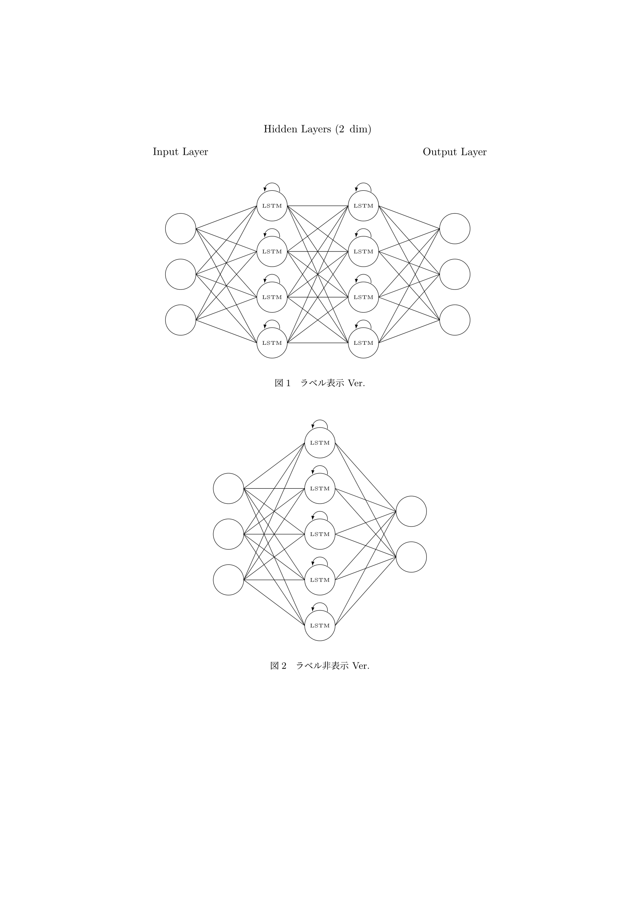
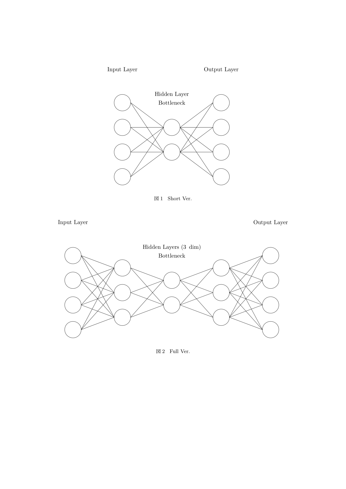

# Neural Network Drawing Package (TikZ)

[[ja]](./README.md)

## Installation

### 1. Clone the repository

```bash
$ git clone https://github.com/rice8y/tikz-nn.git
$ cd tikz-nn
```

### 2.  Install the package using `.sh` or `.bat`

> [!CAUTION]
> The operation has not been verified with MiKTeX.

#### 2-1. If using `.sh`

```bash
$ chmod +x install.sh
$ ./install.sh
```

<details>
<summary>Example execution on WSL2 (Ubuntu)</summary>

```bash
$ ./install.sh
Package tikz-nn version 0.1.0 installed successfully!

```

</details>

#### 2-2. If using `.bat`

```cmd
> install.bat
```

<details>
<summary>Example execution on Windows (cmd)</summary>

```cmd
> install.bat
        1 file(s) copied.
mktexlsr: Updating C:/texlive/texmf-local/ls-R...
mktexlsr: Updated C:/texlive/texmf-local/ls-R.
mktexlsr: Updating C:/texlive/2022/texmf-config/ls-R...
mktexlsr: Updated C:/texlive/2022/texmf-config/ls-R.
mktexlsr: Updating C:/texlive/2022/texmf-var/ls-R...
mktexlsr: Updated C:/texlive/2022/texmf-var/ls-R.
mktexlsr: Updating C:/texlive/2022/texmf-dist/ls-R...
mktexlsr: Updated C:/texlive/2022/texmf-dist/ls-R.
mktexlsr: Done.
Package tikz-nn version 0.1.0 installed successfully!

```

</details>

## Usage

Load the `tikz-nn.sty` package in the preamble:

```latex
\usepackage{tikz-nn}
```

### 1. Fully Connected Neural Network `\fcnn`

```latex
\fcnn[hidden layers]{input}{hidden}{output}
```

**hidden layers**: Number of hidden layers (optional, default: 3)  
**input**: Number of input nodes (required)  
**hidden**: Number of nodes in each hidden layer (required)  
**output**: Number of output nodes (required)

> [!TIP]
> Use `\fcnn` to display labels and `\fcnn*` to hide labels.

At present, there is no scaling option, so please adjust as needed. Additionally, the number of nodes is the same across all hidden layers.

#### Example Usage of `\fcnn`

```latex
\documentclass{ltjsarticle}
\usepackage{float}
\usepackage{tikz-nn}
\pagestyle{empty}

\begin{document}
\begin{figure}[H]
  \fcnn{3}{6}{4}
  \caption{ラベル表示 Ver.}
\end{figure}
\begin{figure}[H]
  \fcnn*[4]{3}{2}{4}
  \caption{ラベル非表示 Ver.}
\end{figure}
\end{document}
```


### 2. Recurrent Neural Network `\rnn`

```latex
\rnn[hidden layers]{input}{hidden}{output}
```

**hidden layers**: Number of hidden layers (optional, default: 2)  
**input**: Number of input nodes (required)  
**hidden**: Number of nodes in each hidden layer (required)  
**output**: Number of output nodes (required)

> [!TIP]
> Use `\rnn` to display labels and `\rnn*` to hide labels.

Like `\fcnn`, there is no scaling option at this time, so please adjust accordingly. Additionally, the number of nodes is the same across all hidden layers.

#### Example Usage of `\rnn`

```latex
\documentclass{ltjsarticle}
\usepackage{float}
\usepackage{tikz-nn}
\pagestyle{empty}

\begin{document}
\begin{figure}[H]
  \rnn{3}{4}{3}
  \caption{ラベル表示 Ver.}
\end{figure}
\begin{figure}[H]
  \rnn*[1]{3}{5}{2}
  \caption{ラベル非表示 Ver.}
\end{figure}
\end{document}
```


### 3. Long Short Term Memory `\lstm`

```latex
\lstm[hidden layers]{input}{hidden}{output}
```

**hidden layers**: Number of hidden layers (optional, default: 2)  
**input**: Number of input nodes (required)  
**hidden**: Number of nodes in each hidden layer (required)  
**output**: Number of output nodes (required)

> [!TIP]
> Use `\lstm` to display labels and `\lstm*` to hide labels.

Like `\fcnn`, there is no scaling option at this time, so please adjust accordingly. Additionally, the number of nodes is the same across all hidden layers.

#### Example Usage of `\lstm`

```latex
\documentclass{ltjsarticle}
\usepackage{float}
\usepackage{tikz-nn}
\pagestyle{empty}

\begin{document}
\begin{figure}[H]
  \lstm{3}{4}{3}
  \caption{ラベル表示 Ver.}
\end{figure}
\begin{figure}[H]
  \lstm*[1]{3}{5}{2}
  \caption{ラベル非表示 Ver.}
\end{figure}
\end{document}
```



### 4. Autoencoder `\ae`

```latex
\ae[style]{input/output}{hidden}
```

**style**: Type of hidden layers [full/short] (optional, default: short)  
**input/output**: Number of input/output nodes (required)  
**hidden**: Number of nodes in the hidden (latent vector) layer (required)

> [!TIP]
> Use `\ae` to display labels and `\ae*` to hide labels.

Like `\fcnn`, there is no scaling option at this time, so please adjust accordingly.

#### Example Usage of `\ae`

```latex
\documentclass{ltjsarticle}
\usepackage{float}
\usepackage{tikz-nn}
\pagestyle{empty}

\begin{document}
\begin{figure}[H]
  \ae{4}{2}
  \caption{Short version.}
\end{figure}
\begin{figure}[H]
  \ae[full]{4}{2}
  \caption{Full version.}
\end{figure}
\end{document}
```



## 5. Other Neural Networks

In progress...
