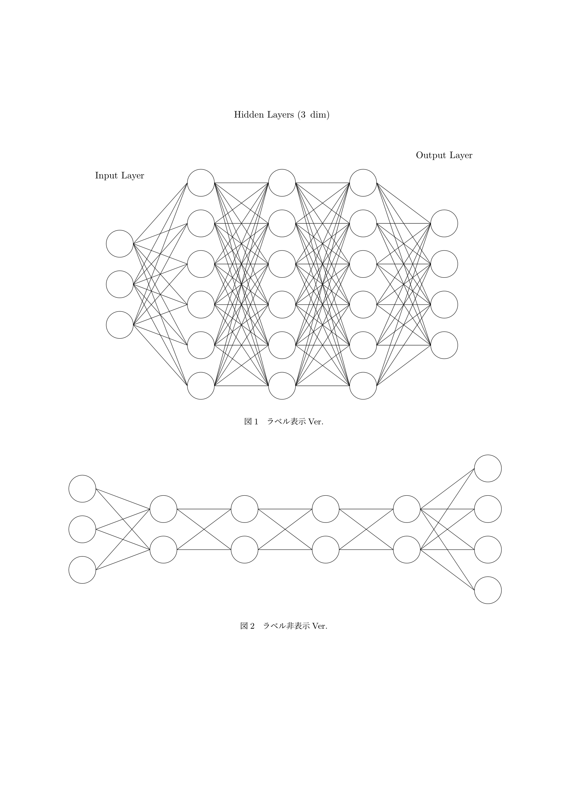
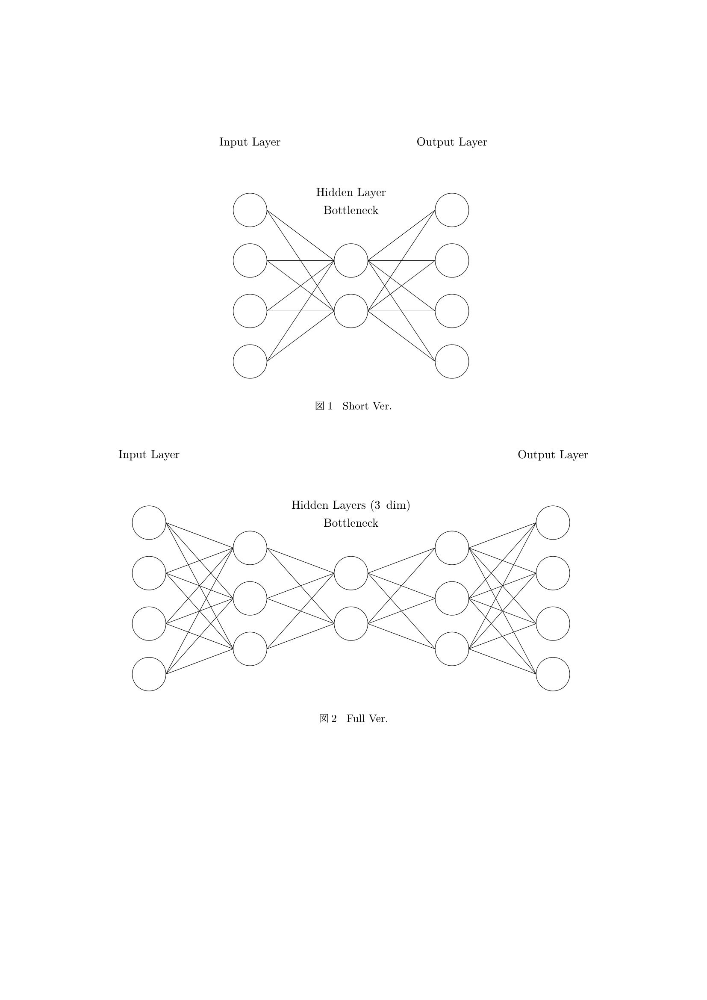

# ニューラルネットワーク描画パッケージ (Tikz)

## Usage

プリアンブルで `tikz-nn.sty` を読み込む.

```latex
\usepackage{tikz-nn}
```

### 1. 全結合型ニューラルネットワーク `\fcnn`

```latex
\fcnn[hidden layers]{input}{hidden}{output}
```

**hidden layers**: 隠れ層の層数 (option, default: 3)  
**input**: 入力層のノード数 (required)  
**hidden**: 隠れ層のノード数 (required)  
**output**: 出力層のノード数 (required)

> [!TIP]
> `\fcnn` でラベル表示, `\fcnn*` でラベル非表示.

なお, 現時点でスケーリングオプションは無い為, 必要に応じて対処してください. また, 隠れ層の各層におけるノード数は均一です.

#### `\fcnn` の使用例

```latex
\documentclass{ltjsarticle}
\usepackage{float}
\usepackage{tikz-nn}
\pagestyle{empty}

\begin{document}
\begin{figure}[H]
  \fcnn{3}{6}{4}
  \caption{ラベル表示Ver.}
\end{figure}
\begin{figure}[H]
  \fcnn*[4]{3}{2}{4}
  \caption{ラベル非表示Ver.}
\end{figure}
\end{document}
```



### 2. オートエンコーダ `\ae`

```latex
\ae[style]{input/output}{hidden}
```

**style**: 隠れ層の形式 [full/short] (option, default: short)  
**input/output**: 入力層/出力層のノード数 (required)  
**hidden**: 隠れ層 (潜在ベクトル) のノード数 (required)  

> [!TIP]
> `\ae` でラベル表示, `\ae*` でラベル非表示.

`\fcnn` 同様, 現時点でスケーリングオプションは無い為, 必要に応じて対処してください.

#### `\ae` の使用例

```latex
\documentclass{ltjsarticle}
\usepackage{float}
\usepackage{tikz-nn}
\pagestyle{empty}

\begin{document}
\begin{figure}[H]
  \ae{4}{2}
  \caption{Short Ver.}
\end{figure}
\begin{figure}[H]
  \ae[full]{4}{2}
  \caption{Full Ver.}
\end{figure}
\end{document}
```



### 3. 他のニューラルネットワーク

作成中...
