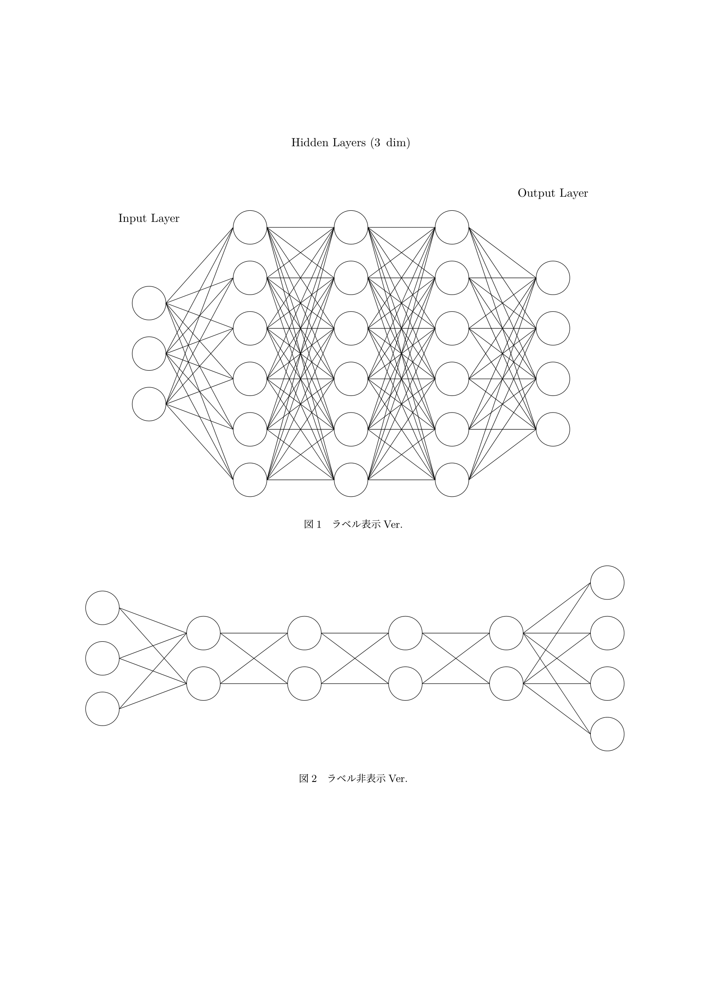
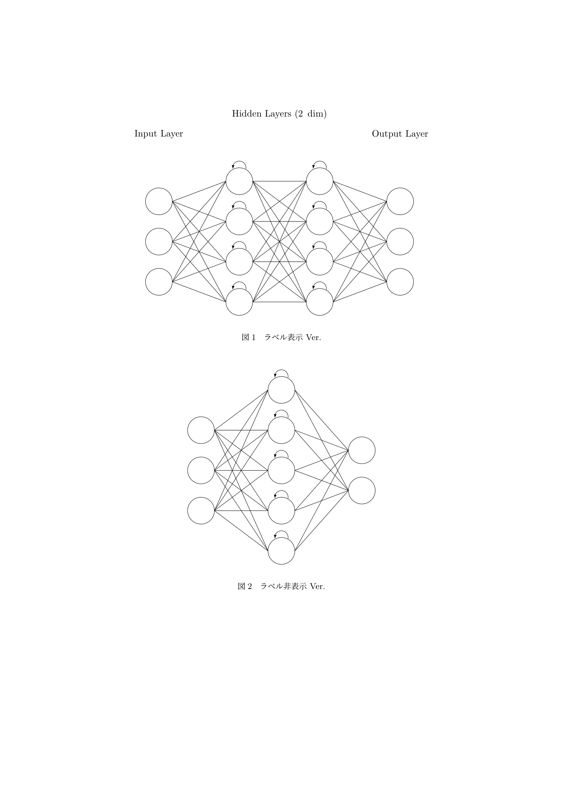
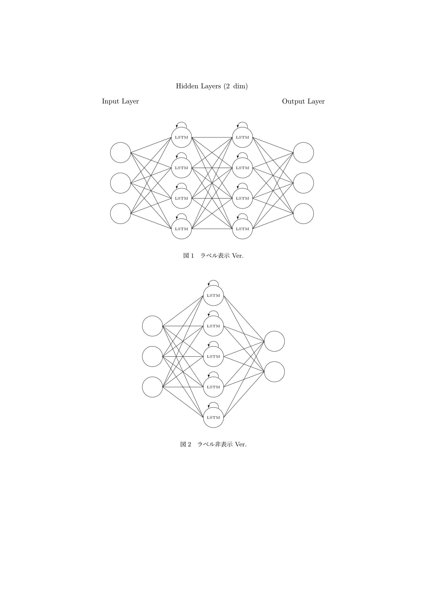
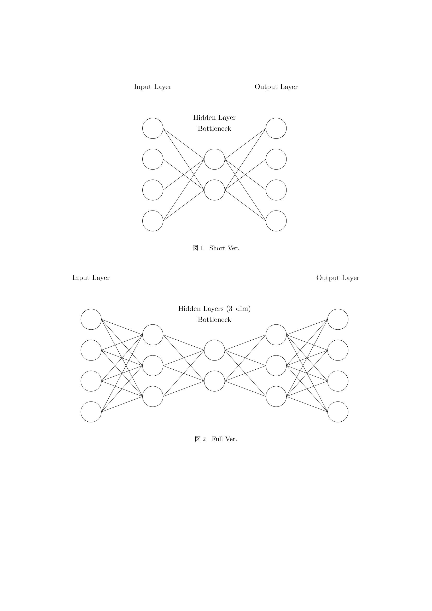

# ニューラルネットワーク描画パッケージ (Tikz)

[[en]](./README-en.md)

## Installation

### 1. `git clone` する

```bash
$ git clone https://github.com/rice8y/tikz-nn.git
$ cd tikz-nn
```

### 2. `.sh` か `.bat` でパッケージをインストールする

> [!CAUTION]
> MiKTeX での動作検証はしていません.

#### 2-1. `.sh` の場合

```bash
$ chmod +x install.sh
$ ./install.sh
```

<details>
<summary>WSL2 (Ubuntu) での実行例</summary>

```bash
$ ./install.sh
Package tikz-nn version 0.1.0 installed successfully!

```

</details>

#### 2-3. `.bat` の場合

```cmd
> install.bat
```

<details>
<summary>Windows (cmd) での実行例</summary>

```cmd
> install.bat
        1 file(s) copied.
mktexlsr: Updating C:/texlive/texmf-local/ls-R...
mktexlsr: Updated C:/texlive/texmf-local/ls-R.
mktexlsr: Updating C:/texlive/2022/texmf-config/ls-R...
mktexlsr: Updated C:/texlive/2022/texmf-config/ls-R.
mktexlsr: Updating C:/texlive/2022/texmf-var/ls-R...
mktexlsr: Updated C:/texlive/2022/texmf-var/ls-R.
mktexlsr: Updating C:/texlive/2022/texmf-dist/ls-R...
mktexlsr: Updated C:/texlive/2022/texmf-dist/ls-R.
mktexlsr: Done.
Package tikz-nn version 0.1.0 installed successfully!

```

</details>

## Usage

プリアンブルで `tikz-nn.sty` を読み込む.

```latex
\usepackage{tikz-nn}
```

### 1. 全結合型ニューラルネットワーク `\fcnn`

```latex
\fcnn[hidden layers]{input}{hidden}{output}
```

**hidden layers**: 隠れ層の層数 (option, default: 3)  
**input**: 入力層のノード数 (required)  
**hidden**: 隠れ層のノード数 (required)  
**output**: 出力層のノード数 (required)

> [!TIP]
> `\fcnn` でラベル表示, `\fcnn*` でラベル非表示.

なお, 現時点でスケーリングオプションは無い為, 必要に応じて対処してください. また, 隠れ層の各層におけるノード数は均一です.

#### `\fcnn` の使用例

```latex
\documentclass{ltjsarticle}
\usepackage{float}
\usepackage{tikz-nn}
\pagestyle{empty}

\begin{document}
\begin{figure}[H]
  \fcnn{3}{6}{4}
  \caption{ラベル表示Ver.}
\end{figure}
\begin{figure}[H]
  \fcnn*[4]{3}{2}{4}
  \caption{ラベル非表示Ver.}
\end{figure}
\end{document}
```



### 2. 再帰型ニューラルネットワーク `\rnn`

```latex
\rnn[hidden layers]{input}{hidden}{output}
```

**hidden layers**: 隠れ層の層数 (option, default: 2)  
**input**: 入力層のノード数 (required)  
**hidden**: 隠れ層のノード数 (required)  
**output**: 出力層のノード数 (required)

> [!TIP]
> `\rnn` でラベル表示, `\rnn*` でラベル非表示.

`\fcnn` 同様, 現時点でスケーリングオプションは無い為, 必要に応じて対処してください. また, 隠れ層の各層におけるノード数は均一です.

#### `\rnn` の使用例

```latex
\documentclass{ltjsarticle}
\usepackage{float}
\usepackage{tikz-nn}
\pagestyle{empty}

\begin{document}
\begin{figure}[H]
  \rnn{3}{4}{3}
  \caption{ラベル表示 Ver.}
\end{figure}
\begin{figure}[H]
  \rnn*[1]{3}{5}{2}
  \caption{ラベル非表示 Ver.}
\end{figure}
\end{document}
```



### 3. 長・短期記憶 `\lstm`

```latex
\lstm[hidden layers]{input}{hidden}{output}
```

**hidden layers**: 隠れ層の層数 (option, default: 2)  
**input**: 入力層のノード数 (required)  
**hidden**: 隠れ層のノード数 (required)  
**output**: 出力層のノード数 (required)

> [!TIP]
> `\lstm` でラベル表示, `\lstm*` でラベル非表示.

`\fcnn` 同様, 現時点でスケーリングオプションは無い為, 必要に応じて対処してください. また, 隠れ層の各層におけるノード数は均一です.

#### `\lstm` の使用例

```latex
\documentclass{ltjsarticle}
\usepackage{float}
\usepackage{tikz-nn}
\pagestyle{empty}

\begin{document}
\begin{figure}[H]
  \lstm{3}{4}{3}
  \caption{ラベル表示 Ver.}
\end{figure}
\begin{figure}[H]
  \lstm*[1]{3}{5}{2}
  \caption{ラベル非表示 Ver.}
\end{figure}
\end{document}
```



### 4. オートエンコーダ `\ae`

```latex
\ae[style]{input/output}{hidden}
```

**style**: 隠れ層の形式 [full/short] (option, default: short)  
**input/output**: 入力層/出力層のノード数 (required)  
**hidden**: 隠れ層 (潜在ベクトル) のノード数 (required)  

> [!TIP]
> `\ae` でラベル表示, `\ae*` でラベル非表示.

`\fcnn` 同様, 現時点でスケーリングオプションは無い為, 必要に応じて対処してください.

#### `\ae` の使用例

```latex
\documentclass{ltjsarticle}
\usepackage{float}
\usepackage{tikz-nn}
\pagestyle{empty}

\begin{document}
\begin{figure}[H]
  \ae{4}{2}
  \caption{Short Ver.}
\end{figure}
\begin{figure}[H]
  \ae[full]{4}{2}
  \caption{Full Ver.}
\end{figure}
\end{document}
```



### 5. 他のニューラルネットワーク

作成中...
